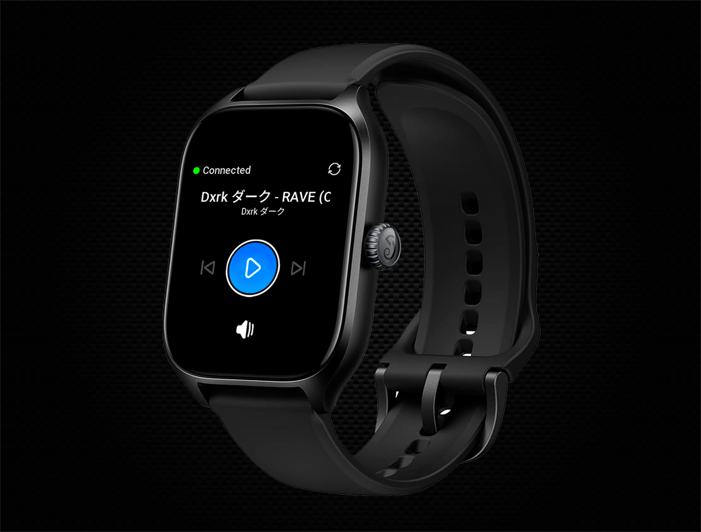

<br />
<p align="center">
  <a href="https://github.com/StarPandaBeg/RemoteMediaClient">
    
  </a>

  <h3 align="center">Remote Media - ZeppOS Client</h3>

  <p align="center">
    Client application written for ZeppOS v2.0 for remote desktop media control
    <br/>
    <br/>
    · Tested on Amazfit GTS 4 ·
  </p>
</p>

---

<div align="center">
  
</div>
<br/>

# Features

- Play/Pause current media
- Play next/previous track
- View information about current playing track
- Adjust device sound volume

# Getting started

> ⚠️ To use application you need to have configured [RemoteMediaWebServer](https://github.com/StarPandaBeg/RemoteMediaWebServer) and install [RemoteMedia](https://github.com/StarPandaBeg/RemoteMediaService) service on your desktop device. Only Windows desktop supported.

To get a local copy up and running follow these simple steps.

## Installation

1. Clone the repo

   ```bash
   $ git clone https://github.com/StarPandaBeg/RemoteMediaClient.git
   ```

1. Install required dependencies:

   ```bash
   # Install Zeus CLI
   $ npm i @zeppos/zeus-cli -g

   # Install node dependencies
   $ npm i
   ```

1. Rename `app-side/config.example.js` to `app-side/config.js` and configure application:

   ```javascript
   export default {
     auth_url: "", // Url which used to authorize client to send commands & get access token
     control_url: "", // Url which used to send commands to the remote server
     login: "", // Client credentials to authorize at the web service
     password: "", // Client credentials to authorize at the web service
   };
   ```

1. Build application

   ```bash
   # Execute to get .zab file
   $ zeus build

   # Or generate QR-code to scan it via Zepp application
   $ zeus preview
   ```

   [Read more at Zepp official docs](https://docs.zepp.com/docs/v2/guides/tools/cli/)

Now application will be in your device app list

# Contributing

Contributions are what make the open source community such an amazing place to be learn, inspire, and create. Any contributions you make are **greatly appreciated**.

1. Fork the Project
2. Create your Feature Branch
   `git checkout -b feature/feature`
3. Commit your Changes
   `git commit -m 'Add some feature'`
4. Push to the Branch
   `git push origin feature/feature`
5. Open a Pull Request

# License

Distributed under the MIT License.  
See `LICENSE` for more information.

# Disclaimer

This project was created for learning purposes on how to develop applications for ZeppOS and network applications in general. It may contain errors or inaccuracies. I would appreciate your feedback and suggestions for improvement. Thanks! 💗
